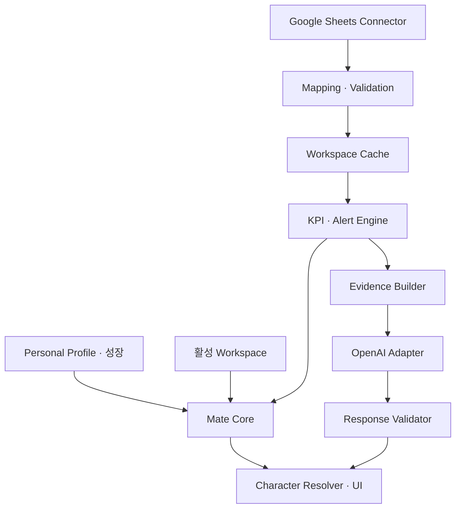

# MARKETING MATE v0.1 FINAL

문서 버전: 1.0 FINAL (설계 패치 1) · 작성일: 2026-10-07 · 언어: 한국어 · 대상: 제품 담당자 / Codex 구현 담당자

**제품 정의: 내 커리어를 따라다니는 개인 AI 마케팅 파트너.**

문서 상태: **FINAL 설계 계약 확정 / 외부 연동·실제 에셋 검증 대기**. 이 문서는 설계 산출물이며 애플리케이션 코드, 실행 파일 또는 검증 완료 보고서가 아니다. Codex는 본문에 확정한 기본값으로 구현을 시작한다. 실제 회사 시트 연결과 배포에는 26장의 외부 준비 항목이 필요하다.

## 1. Product Overview

Windows 바탕화면에 상주하는 개인화 픽셀 캐릭터가 광고 성과 조회, 근거 기반 질의응답, 이상징후 확인의 진입점이 된다. 업무 활동에 따라 성장하되 성과 악화나 미접속으로 사용자를 벌하지 않는다. 회사를 바꾸면 Workspace와 데이터 연결을 교체하고, 캐릭터·개인 설정·성장은 유지한다.

| 구분 | v0.1 확정 |
|---|---|
| 사용자 | 한 Windows 사용자 계정의 개인 마케터 1명 |
| 지원 환경 | Windows 11 x64 우선 공식 검증. Windows 10·ARM64는 v0.1 공식 검증 제외 |
| 기술 | Tauri 2 / React / TypeScript / Rust / SQLite |
| 외부 데이터 | Google Sheets 읽기 전용, 수동 새로고침 |
| 기준 | Asia/Seoul, KRW. v0.1에서는 변경 불가 |
| AI | 사용자 OpenAI API Key와 모델 설정. 없으면 로컬 KPI·알림·캐릭터 사용 가능 |
| 독립성 | ChatGPT 내 펫이 아닌 별도 Windows 앱. ChatGPT 연결 계정·토큰을 승계하지 않음 |
| 성공 조건 | 다른 컬럼명의 시트로 바꿔도 Core 변경 없이 같은 분석·캐릭터 사용 |

첨부 요구서를 제품 요구사항의 기준으로 사용했다. 본문의 임계값, 데이터 타입, 성장 공식, UI 동작 등 추가 구체화는 **이번 설계에서 정한 제품 기본값**이며 기존 시트의 실제 값이나 검증된 사업 성과가 아니다. API 동작 근거는 28장에 분리했다.

## 2. 설계 원칙과 모순 해결

| 원문에서 모호했던 항목 | 최종 결정 |
|---|---|
| 개인 대화 기억을 모두 유지 | 개인 선호 기억만 전역 유지. 회사 관련 대화·요약·업무 습관의 회사 세부 내용은 Workspace 귀속 |
| 캐릭터 클릭 → 채팅 / Quick Panel | 한 번 클릭은 Quick Panel, 두 번 클릭은 AI Chat |
| SURPRISED 예시와 필수 5상태 충돌 | v0.1에는 5상태만. 광고비 급증은 WORRIED + 알림 배지 |
| 특정 셀에 종속되지 않기 / 우측 총매출 영역 | 범위·헤더·열·정규화 규칙을 SourceBinding 설정에 저장. Core에 셀 주소 없음 |
| 오늘 광고 질문 / 수동 일간 데이터 | 기본 성과는 최근 완료일인 어제. 명시적 오늘 질문은 잠정 데이터로 별도 표시 |
| 모든 오류에서 분석 중지 | 영향 범위의 KPI와 AI 해석만 차단. 다른 정상 브랜드·지표는 조회 가능 |
| API 추가 시 Core 변경 없음 | 공통 지원 필드 내 Connector 추가는 Core 유지. 신규 지표·grain은 계약 버전 변경 필요 |
| 육성 예시의 주간 리포트 | 간단 주간 요약·Markdown 저장 포함. 별도 리포트 편집기·PDF·PPT 제외 |
| Workspace 삭제와 캐시 옵션 | 삭제는 회사 데이터 전체 삭제. 데이터 보존은 별도의 보관(Archive) 동작 |
| 외부 연동 미확정 / 바로 구현 | 제품 동작은 확정. 자격증명·실제 매핑·에셋 검수는 외부 준비 조건으로 분리 |

## 3. User Scenario

1. **첫 연결:** 이름과 캐릭터를 확인하고 VOMC Workspace를 만든다. Google 인증 후 시트 URL을 넣고 RAW_DATA 광고 영역을 매핑한다. 총매출·메모·SETTING 영역은 각자 추가 연결한다. 미리보기와 검증을 통과하면 첫 스냅샷을 저장한다.
2. **매일 업무:** 앱 실행 → 캐릭터 표시 → 어제 기준 캐시와 마지막 수집 시각 확인 → 사용자가 새로고침 → KPI·알림 재계산 → “어디가 문제야?” 질문 → 수치와 원인 후보 확인.
3. **회사 이동:** 개인 전용 백업 생성 → 기존 Workspace 보관 또는 삭제 → 새 Workspace 생성 → 새 시트 매핑. 캐릭터 레벨과 개인 말투는 그대로이며 이전 회사 수치·대화는 새 회사 AI 답변에 포함되지 않는다.
4. **네트워크 장애:** 캐시는 계속 조회한다. 마지막 수집 시각과 최신성 경고를 표시하고 외부 새로고침은 실패 상태로 종료한다. 인터넷이 없으면 AI API 분석은 제공하지 않는다.
5. **시트 구조 변경:** 헤더 변경을 감지하면 기존 캐시를 유지하고 재매핑 화면을 연다. 잘못된 열을 임의로 광고매출로 읽지 않는다.
6. **소재 질문:** creative가 없는 데이터에서는 “현재 연결 데이터에 소재 단위가 없습니다”라고 답한다. 캠페인 성과를 소재 성과로 표현하지 않는다.

## 4. 시스템 경계와 Technical Architecture

React는 화면·애니메이션·입력만 담당한다. Rust가 파일 접근, 인증, 네트워크, DB, 수치 계산, 알림, 백업을 소유한다. 프런트엔드에서 API Key·OAuth 토큰·자유 SQL을 취급하지 않는다. React가 보내는 workspace_id는 신뢰하지 않고 Rust에서 현재 세션과 대조한다.

프로세스는 단일 인스턴스로 실행한다. 두 번째 실행은 기존 패널을 연다. UI 창은 pet / panel / settings 3종으로 분리한다. 동기화·AI는 비동기 작업이며 각각 취소 토큰을 가진다. 숫자 계산은 Decimal, 저장 금액은 0.01 KRW 단위 정수, 화면은 원 단위 반올림을 기본으로 한다.

모듈 경계: profile, workspace, connector, mapping, validation, repository, kpi, alert, evidence, ai, character, growth, backup, desktop. Connector가 SQL에 직접 쓰지 않고 SyncService가 검증 후 commit한다. KPI·Alert·Growth 엔진은 네트워크 없이 테스트 가능해야 한다.

## 5. IA와 화면 계약

| 화면 | 주요 내용 | 고정 상태 표시 |
|---|---|---|
| Desktop Character | 캐릭터·짧은 말풍선·알림 배지 | 연결 오류는 배지, 개인 성장과 분리 |
| Quick Panel | AI Chat / 어제 성과 / Alert / Level·EXP / Refresh | Workspace, 기간, 캐시 시각 |
| AI Chat | 질문·근거 카드·관련 메모·액션 후보 | 답변 생성 당시 Workspace·기간·snapshot_id |
| 성과 패널 | KPI, 브랜드·채널 필터, 비교, 데이터 한계 | 광고매출과 브랜드 총매출 카드 분리 |
| Alert | 발생/확인/해결 상태·증거·메모 | 기준일·임계값·비교 기준 |
| 주간 요약 | 완료한 지난주 성과·알림·메모·액션 | 집계 기간·불완전 항목·Markdown 저장 |
| Settings | Personal Profile / Workspace / Data Source / Field Mapping / KPI Rules / AI / Character / Notification / Backup | 저장·취소, 오류 안내 |

Quick Panel 기본 400×560 DIP, 상세 패널 960×720 DIP, 최소 760×560 DIP. 작은 화면은 세로 스크롤한다. 한국어 UI이며 통화 기호·천 단위 구분을 사용한다. null은 “—”, 실제 0은 “0”이다. 색상만으로 상태를 구분하지 않고 아이콘·텍스트를 함께 제공한다.

공통 필터는 활성 Workspace 안에서만 유지한다. 브랜드=전체, 채널=전체, 기간=어제가 초기값이다. Workspace 전환 시 이전 Workspace 필터를 새 데이터에 적용하지 않는다. 이전 회사로 돌아가면 그 회사의 마지막 필터를 복구한다.

## 6. Desktop Pet UX

- 투명 배경·테두리 없음. 기본 192×192 DIP, 확대 100/150/200%, nearest-neighbor 렌더링. 초기 위치는 주 모니터 작업영역 우하단 24 DIP 안쪽이다.
- 항상 위 ON 기본, 자동 실행 OFF 기본. 창을 강제로 활성화하거나 사용자의 타이핑 포커스를 빼앗지 않는다.
- 드래그 판정은 누른 뒤 6 DIP 이상 이동. 드래그는 클릭으로 계산하지 않는다. 더블클릭 판정은 Windows 설정을 따르며 한 번 클릭 동작은 판정 시간까지 지연한다.
- 우클릭: Quick Panel / Chat / Workspace 선택 / 새로고침 / 항상 위 / 클릭 통과 / 숨기기 / 설정 / 종료.
- Click-through는 **캐릭터 창 전체** 단위 ON/OFF. 투명 픽셀별 정밀 클릭 판정은 v0.1 제외. ON이면 캐릭터 클릭이 불가능하며 트레이에서 OFF로 복구한다. 트레이 메뉴는 항상 접근 가능하다. Tauri 창 API를 사용한다.[T1]
- 숨기기는 앱 종료가 아니다. 숨김·클릭 통과 상태에서도 트레이에서 패널·설정·종료 가능. 종료는 진행 중 작업 취소와 DB 정리 후 완료한다.
- 기본은 제자리. 자율 걷기는 사용자 ON일 때만 60~120초 간격, 24 DIP/s, 최대 96 DIP 이동 후 IDLE. 작업영역 경계 안으로 제한한다. 드래그·분석·패널 사용 중에는 중지한다.
- 다중 모니터·DPI 변화 시 위치를 재계산한다. 저장된 모니터가 없으면 주 모니터로 복귀한다. 창 위치와 배율을 저장한다.
- 말풍선은 최대 2줄·8초, 1분당 1회. 알림 카드는 패널에서 유지한다. 소리 OFF, 업무시간 밖 외부 팝업 OFF가 기본이다.

## 7. Personal Profile과 기억

단일 profile_id(UUID)에 user_name, character_id, character_skin, preferred_tone, ai_personality, preferred_report_style, preferred_kpis, work_start_time, work_end_time, notification_preference, personal_settings를 저장한다. 기본 이름은 “명규”를 미리 채우되 수정 가능하다. 말투는 “간결하고 친근한 존댓말”, 업무시간은 평일 09:00~18:00 KST로 시작한다.

character_level, character_exp, affinity, character_mood, unlocked_actions, unlocked_items는 character_state에 저장한다. Profile에는 회사명·광고계정·시트 URL·목표 ROAS를 저장하지 않는다.

**대화 기억 정책**

| 데이터 | 범위 | 생성·삭제 |
|---|---|---|
| 일반 개인 대화 기록 | PERSONAL 스레드 | 사용자가 선택한 개인 대화만. 회사 질문은 활성 Workspace 스레드로 안내 |
| 말투·보고 형식·업무 습관 선호 | 전역 personal_memory | 자동 승격 금지. 설정 화면에서 직접 입력·확인한 항목만 |
| 회사 질문·응답·요약 | workspace_id 필수 | 회사별 저장, 다른 Workspace retrieval 금지 |
| 성장 이력 | 전역 | 사건 유형·EXP·일자만 유지. 브랜드·매출·질문 본문 저장 금지 |

업무 대화에서 “이런 보고 형식을 선호한다”를 발견해도 자동으로 개인 기억에 저장하지 않는다. 사용자 확인 후 숫자·브랜드·회사 정보를 제거한 선호만 저장한다. 대화는 기본 90일 후 삭제하며 사용자 설정으로 즉시 삭제·기간 변경이 가능하다. 개인 기억과 회사 기억을 각각 열람·삭제할 수 있다. 전역 벡터 검색은 v0.1 제외한다.

## 8. Workspace 계약

workspace_id(UUID), workspace_name, company_name, currency=KRW, timezone=Asia/Seoul, lifecycle(active/archived), default_workspace, target_roas, target_cpa, attribution_notes, reporting_rules, custom_notes를 가진다. brands/channels/data_sources/field_mappings는 별도 테이블로 연결한다.

목표는 기본 미설정(null). 사용자가 ROAS 300%를 입력하면 내부 3.0으로 저장한다. CPA는 KRW 금액이다. 목표 우선순위는 브랜드×채널 → 브랜드 → Workspace이며, 목표 미설정 시 목표 달성 판단을 하지 않는다.

- 생성: 빈 환경. 기존 회사 소스나 기억을 자동 복사하지 않는다.
- 복제: 규칙·매핑 템플릿·표시 설정만 복제. 회사명은 새로 입력, 브랜드·채널은 복제 옵션 기본 OFF. 실제 데이터·대화·알림·메모·시트 ID·인증 참조는 복제하지 않는다.
- 전환: 기존 AI·동기화 취소 → generation 증가 → 활성 Workspace 변경 → 해당 캐시 조회. 늦게 돌아온 이전 응답은 현재 화면·알림·성장 이벤트에 반영하지 않는다.
- 보관: 읽기 전용 조회만 제공. 동기화·AI API 호출·알림 없음.
- 삭제: 영향 데이터와 이름 확인 후 데이터·메모·대화·매핑·알림 삭제. 개인 성장 유지. 다른 Workspace가 쓰는 Google 자격증명은 삭제하지 않는다. 마지막 참조가 없어지면 자격증명 삭제 여부를 안내한다.
- 기본 Workspace 삭제 시 가장 최근 사용한 비보관 Workspace로 이동. 없으면 Workspace 생성 화면.

회사별 종합 조회는 지원하지만 **Workspace 간 매출 합산과 AI 교차 분석은 제공하지 않는다.**

## 9. Data Connector와 Google Sheets Connector

### 9.1 추상 인터페이스

| 작업 | 입력 | 반환·의미 |
|---|---|---|
| connect | provider 설정·인증 요청 | credential_ref, 연결 상태 |
| disconnect | source_id | 해당 소스 연결 해제. 원본 시트 삭제 없음 |
| test_connection | source_id | 인증·메타데이터 접근 가능 여부 |
| fetch_schema | spreadsheet_id | sheetId·제목·locale·timezone·헤더 후보·열 타입 표본 |
| fetch_data | binding·범위·취소 토큰 | RawBatch, origin 좌표, source metadata |
| normalize | RawBatch·MappingVersion | 표준 RecordBatch와 검증 결과 |
| refresh | source_id·binding 집합 | SyncService에 스냅샷 수집 요청 |
| get_last_sync_time | source_id | 마지막 성공 UTC 시각, 실패 시각 별도 |
| get_status | source_id | disconnected/needs_auth/ready/syncing/error |

fetch_data의 RawBatch는 Connector 내부 작업 경계이다. **Core가 받는 최종 결과는 정규화한 표준 RecordBatch**다. Google Connector도 공유 Mapping Engine을 사용한다. Connector는 지원 dataset 종류, dimensions, snapshot 지원 여부를 capabilities로 선언한다. CSV/Excel/API 구현은 v0.1에서 생성하지 않는다.

### 9.2 OAuth와 연결 흐름

Google Desktop OAuth client + 시스템 브라우저 + Authorization Code / PKCE(S256), 일회용 state, loopback 127.0.0.1 임의 포트를 사용한다. 인앱 로그인 웹뷰는 사용하지 않는다. 인증 시도는 5분 만료, 성공/실패 후 리스너 종료.[G1]

v0.1은 **시트 URL 또는 ID 입력**으로 확정한다. 선택 목록은 이미 앱에 등록한 시트만 제공한다. 전체 Drive 파일 선택기는 제외한다. 범위는 spreadsheets.readonly를 요청하고 쓰기·Drive 전체 읽기는 요청하지 않는다. 이 권한 자체는 계정의 접근 가능한 모든 Sheets 읽기 범위임을 동의 화면에 명시하며, 앱은 사용자가 등록한 ID만 읽는다.[G2]

인증 → URL 검증 → 메타데이터 → 탭·영역 선택 → 헤더 탐색 → 매핑 → 검증 → Test Import → 연결 완료. OAuth 취소는 이전 상태로 돌아간다. ChatGPT에 Google이 연결되어 있어도 이 앱의 인증을 생략하지 않는다.

credential_ref는 OS 비밀 저장소 키의 참조만 DB에 남긴다. 로그아웃은 선택 계정의 로컬 토큰 삭제, 해당 계정의 소스는 needs_auth로 바뀐다. 캐시 삭제는 별도 동작이다. 계정의 모든 Google 접근을 철회하는 동작은 별도 명시 없이 실행하지 않는다.

### 9.3 읽기와 새로고침

spreadsheets 메타데이터와 values 읽기 API를 사용한다. 수치 읽기는 UNFORMATTED_VALUE, 날짜는 SERIAL_NUMBER를 사용하며 사용자가 날짜로 매핑한 열에만 날짜 변환을 적용한다.[G3] 여러 범위는 가능한 한 batchGet으로 묶는다. 5,000행 단위 청크, 전체 100,000행을 검증 목표로 한다. 더 큰 요청은 가져오기 전에 범위 축소를 안내한다.

수동 전체 스냅샷 방식이다. 자동 실행·타이머 동기화는 없다. 429·일시적 5xx는 Retry-After를 우선하고 없으면 1/2/4초+지터, 최대 3회 재시도한다. 요청 타임아웃 30초, 전체 새로고침 180초 후 실패. 사용자는 중간에 취소 가능하다. 중복 Refresh는 기존 작업을 보여주고 새 작업을 만들지 않는다.

Google 읽기는 여러 요청 전체에 원자적 스냅샷을 보장한다고 가정하지 않는다. 앱의 로컬 반영만 원자적이다. 수집 도중 헤더·행수 불일치 감지 시 전체 1회 재수집, 반복되면 원본 편집 종료 후 재시도 안내. 동일 행수의 중간 셀 수정은 완벽히 감지하지 못한다는 한계를 동기화 도움말에 표시한다.

## 10. 현재 VOMC 시트 적용 설계

**아래는 첨부 요구서에 적힌 구조를 대상으로 한 매핑 계획이다. 이번 작업에서 실제 시트 탭·셀·값·timezone을 직접 검증하지 않았다.** 따라서 셀 주소나 연결 성공을 확정 사실로 기록하지 않는다.

| 요구서의 원천 | 내부 dataset | 바인딩 방법 |
|---|---|---|
| RAW_DATA 광고 영역 | marketing_records | 일자×브랜드×채널 및 실제 존재하는 세부 차원 |
| RAW_DATA 우측 브랜드 총매출 | brand_revenue | 광고와 별도 열 범위. long 또는 date+브랜드 열 wide 변환 |
| 바머 간편 대시보드 | marketing_notes / budget_plans | 테이블 영역 별도 지정. 자유 배치 카드는 수동 메모로 전환 |
| SETTING | brand/channel aliases, 목표·기준 후보 | 미리보기 후 명시적 적용, 자동 덮어쓰기 없음 |
| DASHBOARD, DAILY, WEEKLY, MONTHLY, BRAND_ANALYSIS, CHANNEL_ANALYSIS, BRAND_CHANNEL_MATRIX | 원천에서 제외 | 필요 시 원본 링크만 제공 |

동일 탭의 광고 영역과 총매출 영역은 독립 SourceBinding이다. binding_id, sheet_id(숫자형 고유 ID), 열 범위, header_row, 시작행, 종료 정책, dataset_type, mapping_version을 각각 저장한다. 탭 이름은 표시용이며 탭 이름 변경 시 sheet_id로 찾는다.

범용 지원 모양은 ① 헤더 1행의 long table ② 날짜 열+브랜드별 총매출 열의 wide table ③ 1행 1사건의 notes/budget table이다. 다중 헤더·병합 셀·자유 배치 카드의 의미를 AI가 임의 추정하지 않는다. 이런 영역은 복사 가능한 중간 표 또는 앱 내 수동 메모로 입력한다. 기존 시트를 자동 수정하지 않는다.

SETTING에서 브랜드명·채널명·목표를 읽어도 기존 확정 설정에 대한 변경안을 보여주고 사용자가 적용해야 한다. 매핑되지 않은 KPI 규칙을 실행 가능한 코드나 수식으로 해석하지 않는다.

## 11. Field Mapping

1. 탭과 영역을 선택한다. 우측 총매출처럼 같은 탭의 다른 영역도 추가 가능하다.
2. 선택 영역 첫 50행에서 헤더 후보를 탐색한다. 별칭 일치 필드 수가 많은 행을 우선 추천하며 자동 확정하지 않는다.
3. 후보 헤더 공백·대소문자를 정규화한다. 같은 필드에 여러 후보가 있으면 사용자가 선택한다.
4. 필드별 외부 열 또는 고정값을 지정한다. 단일 브랜드/채널 시트는 사용자가 고정값을 명시할 수 있다.
5. 날짜 형식·금액 단위·브랜드/채널 별칭·grain·귀속 기준·상태 열을 확인한다.
6. 표본 100행을 미리 본 뒤 전체 선택 범위를 검증한다. 표본 통과만으로 저장하지 않는다.
7. 검증 결과와 누락 지표를 확인한 뒤 mapping_version을 증가시키고 해당 전체 범위를 다시 가져온다.

| 내부 필드 | 기본 Alias |
|---|---|
| date | 일자, 날짜, Date, Day |
| brand | 브랜드, Brand, Brand Name |
| channel | 광고채널, 채널, Platform, Media, Source |
| spend | 광고비, 소진액, Cost, Spend |
| attributed_revenue | 광고매출, 전환매출, Conversion Revenue; Revenue는 모호 경고 |
| impressions | 노출, 노출수, Impressions |
| clicks | 클릭, 클릭수, Clicks |
| orders | 주문수, 구매, Orders, Purchases |
| total_revenue | 총매출, 브랜드매출, Total Revenue |

Revenue는 dataset 선택 후에도 매출 의미를 확인해야 한다. “매출”만 보고 광고매출·총매출을 동시에 매핑하지 않는다. 외부 비율 CTR/ROAS 컬럼은 참고용으로만 표시하고 기본 집계에 사용하지 않는다.

금액 단위는 원/천원/만원 중 명시적으로 지정, 기본 원. 쉼표·₩·앞뒤 공백 제거 외에는 임의 숫자 추정 금지. 날짜 문자열은 사용자가 선택한 ISO/한국형/미국형 형식으로만 파싱한다. 모호한 03/04/2026은 형식 확정 전 차단한다.

헤더 지문은 열 위치·정규화된 이름·매핑 필드로 만든다. 매핑 열 이동/삭제/이름 변경 시 schema_changed로 차단한다. 사용자에게 새 후보를 제안할 수 있지만 확인 없는 재매핑은 금지한다. 비매핑 영역 변경은 차단하지 않는다.

## 12. Standard Data Schema

### 12.1 공통 타입

ID는 UUID 문자열, 일자는 YYYY-MM-DD business date, 시스템 시각은 UTC RFC3339이다. 업무 일자는 KST 기준. KRW 금액은 0.01원 단위 signed 64-bit 정수이며 입력 정밀도 2자리 초과는 반올림 경고 후 정규화한다. 계산 시 Decimal을 사용하고 표시 단계에서만 반올림한다. 주문·클릭·노출은 0 이상 정수 또는 null. 분수 전환수는 v0.1 orders로 받지 않고 지원 제한을 안내한다.

각 사실 행에는 workspace_id, source_id, binding_id, source_account_id, snapshot_id, mapping_version, source_sheet_id, source_row, imported_at을 포함한다. source_account_id는 사용자 지정 광고계정 식별자이며, 시트 하나에 여러 광고계정이 있으면 열로 매핑한다. 차원별 외부 ID가 없으면 정규화된 이름을 로컬 ID에 매핑하되 이름 변경이 동일 대상임을 자동 추정하지 않는다.

### 12.2 MarketingRecord

| 필드 | 필수 여부·규칙 |
|---|---|
| date, brand_id, channel_id | 필수; 열 또는 명시적 상수 |
| grain | 필수: channel / campaign / ad_group / creative |
| campaign_id, ad_group_id, creative_id | grain에 필요한 차원 필수, 상위 ID도 함께 필요 |
| impressions, clicks | 선택, 없음=null |
| spend | 필수, 0 이상 |
| orders | 선택, 광고 구매 전환수, 없음=null |
| attributed_revenue | 선택, 광고 귀속 매출, 없음=null, 음수는 검증 오류 |
| attribution_basis | 필수 메타데이터, unknown 허용하되 ROAS·CVR·CPA의 기간 비교·성과 알림은 비활성 |
| currency | KRW 고정 |
| note | 선택, 최대 2,000자 |
| input_status | complete / provisional / excluded |

MarketingRecord의 orders는 전체 브랜드 주문수가 아니다. AOV는 광고매출/광고주문으로 “광고 객단가”라 표시한다. 매출이 없는 데이터도 광고비·클릭 분석을 위해 가져올 수 있지만 ROAS를 계산하지 않는다.

논리키: workspace + source_account + date + brand + channel + grain + campaign/ad_group/creative(해당 없음은 빈 키) + attribution_basis + currency. source_id를 추가해 다른 소스의 중복을 숨기지 않는다. 동일 논리키의 복수 행은 자동 합산하지 않고 중복 후보로 차단한다. 더 상세한 원천은 필요한 차원을 먼저 매핑하거나 하나의 집계 표로 정리해야 한다.

동일 계정·브랜드·채널·날짜·귀속 기준에 channel 합계와 creative 상세를 동시에 포함하지 않는다. v0.1에서는 단일 grain을 그 coverage의 권위 원천으로 사용한다. 서로 다른 계정의 데이터는 합산 가능하나 광고 귀속 매출의 중복 전환 가능성을 함께 표시한다.

### 12.3 BrandRevenue

필드: date, brand_id, total_revenue, revenue_basis(gross/net/unknown), note, status, 공통 provenance. 유일키는 workspace+date+brand+currency이다. v0.1은 브랜드당 일간 총매출 1개 권위 원천만 허용한다. “전체몰 총매출”을 채널별 행으로 복제하지 않는다. gross/net이 바뀌면 비교를 중지하고 기준 변경 안내. 음수 총매출은 순환불 가능성 경고와 확인을 거쳐 저장하되 광고비율 분모가 0 이하이면 null이다.

### 12.4 MarketingNote / BudgetPlan

MarketingNote: note_id, workspace_id, brand_id?, channel_id?, campaign_id?, type(promotion/budget_change/operation/exception), start_date, end_date?, title, body, source_origin(sheet/manual), provenance. 기간은 양끝 포함. 제목 120자, 본문 2,000자. 회사 메모는 개인 기억이 아니다.

BudgetPlan: plan_id, workspace_id, brand_id, channel_id?, start_date, end_date, amount_minor, currency, period_type(daily/period), provenance. 일간 예산은 날짜별 금액, 기간 예산은 기간 전체 금액이다. 같은 범위·대상의 중첩 계획은 사용자 수정 전 집행률 계산을 차단한다. 기간 예산의 임의 일할 분배와 당일 조기 소진 알림은 v0.1 제외한다.

## 13. 검증·완전성·날짜

| 등급 | 예 | 처리 |
|---|---|---|
| FATAL | 필수 매핑 누락, 구조 변경, 인증 실패, 파싱 오류, 중복키, 음수 광고비 | 새 스냅샷 전체 commit 중지, 기존 캐시 유지 |
| WARNING | 클릭 0·주문 있음, 광고비 0·매출 있음, unknown 귀속, 음수 총매출 | 경고와 해당 지표 한계를 표시. 정상 지표는 사용 |
| INCOMPLETE | 최근 완료일 행 누락, 옵션 지표 공백, 일부 대상 미입력 | 해당 지표·범위 완료 분석과 알림 차단 |
| INFO | 오늘 잠정값, 매핑되지 않은 선택 필드 | 지원 지표와 조회 제한 안내 |

빈 행은 스킵한다. 합계행은 자동 판단해 조용히 제거하지 않고 사전 지정한 제외 규칙(예: date 열 “합계”)에 해당할 때만 제외한다. 사용자가 오류 행을 제외하려면 원본 좌표와 사유를 선택해야 하며 영향 날짜·대상을 incomplete로 표시한다. 미래 날짜 실적 행은 제외하고 경고, 미래 프로모션/예산 계획은 허용한다.

상태 열이 있으면 사용자 매핑으로 complete/provisional/excluded를 정한다. 상태 열이 없으면 “어제 이전 값은 입력 완료로 간주” 설정을 연결 화면에서 확인받고 날짜별 수동 완료 해제를 제공한다. 수동 해제 상태는 다음 새로고침으로 자동 해소하지 않으며 사용자가 다시 완료 처리한다. 이는 원천 완전성의 증명이 아니라 사용자 선언임을 표시한다.

Workspace에 expected_coverage(브랜드×채널×계정, 활성 시작/종료일, 요일)를 저장한다. 기본은 사용자가 연결 검토에서 확인한 조합·매일 운영이다. 0실적은 0행 또는 명시적 무집행 처리로만 완전하다고 본다. 행이 없다는 이유로 0을 채우지 않는다. 총매출에는 별도의 브랜드별 coverage가 있다. 새 조합은 확인 후 coverage에 추가한다.

**날짜 처리:** 일자만 있는 문자열·시리얼 날짜는 시간대 변환으로 날짜를 이동하지 않는다. 타임스탬프는 명시된 원천 timezone에서 KST로 변환한 날짜를 사용한다. timezone 없는 timestamp는 원천 timezone 확인 전 차단한다. Sheets timezone이 America/Los_Angeles여도 일자 전용 값은 그대로다. TODAY/NOW 등 시트 수식 결과는 원천 timezone 영향이 있으므로 경고하고, 앱이 시트 timezone을 자동 변경하지 않는다.

최신성은 last_successful_sync_at(앱 수집)과 latest_complete_date(업무 데이터)를 따로 표시한다. 마지막 수집 후 24시간 경과 시 stale. Data Missing은 KST 12:00 이후 어제의 expected_coverage에 대해 평가한다. 오래된 캐시만 있을 때는 “미입력 확정” 대신 “최신 데이터 확인 필요” 상태다. 앱 실행·패널 열기·수동 새로고침 완료 때 재평가하며 주기적 외부 수집은 하지 않는다.

## 14. 스냅샷과 중복 방지

새로고침 단위는 한 Workspace의 사용자가 선택한 data_source다. 하나의 source가 여러 영역을 묶으면 모든 필수 binding을 staging에 모은 뒤 **한 트랜잭션**으로 교체한다. 일부 성공 후 일부 실패한 새 데이터가 섞이지 않는다. 다른 source의 캐시는 유지되며 각 source 시각을 표시한다.

검증 → staging 레코드 수·coverage·중복 검사 → snapshot 생성 → 해당 binding 기존 사실행 교체 → coverage 저장 → KPI/Alert 결과 무효화 → commit → 새 snapshot 기준 재계산. 원본에서 지운 행은 새 스냅샷에서 사라진다. 전체 빈 결과는 사용자 확인 전 기존 데이터를 지우지 않는다.

같은 원천 반복 Refresh는 행 수·합계·알림을 늘리지 않는다. source content hash가 동일하면 수집 시각만 갱신하고 no_change로 기록한다. 매핑 버전 변경은 반드시 새 스냅샷으로 기록한다. 연결 범위를 축소할 때 사라질 날짜 범위를 미리 보여준다.

같은 coverage에 다른 source를 연결하면 “대체” 또는 “취소”만 제공한다. 대체는 새 source 검증 완료 후 원래 권위 binding을 비활성화하고 단일 트랜잭션으로 교체한다. 단순히 두 데이터를 더하는 선택은 제공하지 않는다. 월별 탭은 날짜 coverage가 겹치지 않을 때만 함께 사용한다.

## 15. KPI Engine

모든 비율은 **SUM(분자) / SUM(분모)**로 계산한다. 행별 CTR·ROAS 평균 금지. 분모 0은 null. 부분 누락은 0으로 채우지 않는다. 집계 대상 행 중 해당 지표 필수값이 하나라도 null이면 그 전체 지표는 null이며 정상 부분만 별도 필터한 결과임을 표시할 수 있다.

| 화면 이름 | 공식 | 표시 |
|---|---|---|
| 광고비 | Σspend | KRW |
| 광고매출 | Σattributed_revenue | KRW, 플랫폼 귀속 |
| ROAS | Σattributed_revenue / Σspend | 내부 배수, UI % |
| 노출 / 클릭 / 광고 주문 | 각 합계 | 건 |
| CTR | Σclicks / Σimpressions | % |
| CPC | Σspend / Σclicks | KRW |
| CVR | Σorders / Σclicks | % |
| CPA | Σspend / Σorders | KRW |
| 광고 객단가(AOV) | Σattributed_revenue / Σorders | KRW |
| 브랜드 총매출 | Σtotal_revenue | KRW, gross/net 표기 |
| 광고비율 | 같은 브랜드·기간 전체 광고비 / 브랜드 총매출 | % |

총매출과 광고 실적을 날짜×브랜드로 각각 먼저 집계한 뒤 결합한다. 광고 상세행과 총매출을 직접 join해 총매출을 반복 합산하지 않는다. 광고비율은 전체 채널 선택 때만 기본 제공한다. 특정 채널 선택 시 이 카드는 숨기고 브랜드 총매출은 “전체 채널 총매출”로 표시한다.

복수 채널의 광고매출 합계는 “플랫폼 귀속 매출 합계, 중복 전환 가능”로 표기하며 실제 매출로 표현하지 않는다. 같은 채널 내 귀속 기준 변경 전후 비교는 금지한다. 전체 집계 비교는 대상 조합과 귀속 기준 구성이 같을 때만 가능하며 중복 가능성 고지를 유지한다.

### 15.1 기간·비교

기본 d=KST 어제. 어제, 최근 7개 완료일(d-6~d), 지난주(월~일), 이번 달 완료일(1일~d), 사용자 기간 제공. 오늘은 명시적으로 선택할 때만 보여주며 잠정값으로 고지하고 완료 기간과 비교·알림에 넣지 않는다.

| 비교 | 최소 조건·계산 |
|---|---|
| 전일 | d와 d-1 모두 같은 coverage 완료 |
| 전주 동일 요일 | d와 d-7 모두 완료 |
| 최근 7일 평균 | d-7~d-1 전체 완료. 일일 KPI 7개의 산술평균; ‘평균 일일 ROAS’로 명시 |
| 최근 4주 같은 요일 | d-7/-14/-21/-28 모두 완료. 일일 KPI 4개의 중앙값 |
| 7일·사용자 기간 | 직전 동일 길이 완료 기간과 비교 |
| 월 누계 | 전월 동일 경과일 비교. 전월 일수 부족 시 공통 경과일로 양쪽 범위를 줄이고 고지 |

기간 KPI는 언제나 합계의 비율이다. 평균 일일 KPI는 비교 전용 통계로만 사용한다. 7일 또는 4주 비교에서 필요한 일일 KPI에 null이 있으면 비교 없음. 4개 중앙값은 가운데 2개 평균이다.

상대 변화=(현재-기준)/기준, 기준=0이면 null/“기준값 0”. CTR·CVR·ROAS·광고비율은 현재·기준 %와 차이 %p를 표시하고, 규칙 판정은 상대 변화로 한다. 예: ROAS 400%→280%는 -120%p, 상대 -30%. 부분 기간을 완료 기간인 것처럼 비교하지 않는다.

## 16. Alert Engine

룰은 기본적으로 어제의 브랜드×채널×광고계정 단위로 평가한다. 기준은 최근 4주 동일 요일 4개 완료일 중앙값, 부족하면 **해당 성과 룰은 미평가**한다. 자동으로 전일 비교로 낮추지 않는다. 어제 수치와 기준일 모두 같은 매핑·귀속 의미·coverage여야 한다.

| 룰 | 판정(경계 포함) | 현재·기준 최소 조건 | 기본 등급 |
|---|---|---|---|
| ROAS Drop | 상대 변화 ≤ -30% | 각 일 광고비 ≥ 30,000원, 기준 ROAS > 0 | warning |
| CPC Rise | 상대 변화 ≥ +30% | 각 일 클릭 ≥100, 광고비 ≥30,000원, 기준 CPC>0 | warning |
| CVR Drop | 상대 변화 ≤ -30% | 각 일 클릭 ≥100, 기준 4일 주문 합계 ≥10, 기준 CVR>0 | warning |
| Spend Surge | 상대 변화 ≥ +40% | 현재·각 기준일 광고비 ≥30,000원, 기준>0 | warning |
| No Conversion | orders=0 | 어제 클릭 ≥100 AND 광고비 ≥30,000원. 기준 이력 불필요 | warning |
| Data Missing | 어제 coverage 일부 없음 | KST 12시 이후, 최근 24시간 내 성공 수집 | warning |
| Data Quality | 검증 문제 | 문제 유형·영향 범위 표시 | fatal 오류는 critical |

30,000원·100클릭 등의 기본값은 민감도 초기 설정이며 통계적 유의성을 보장하지 않는다. 사용자는 KPI Rules에서 변경 가능하고 rule_version을 저장한다. 전일 비교 UI와 자동 이상징후 기준이 다르다는 설명을 제공한다.

알림 유일키는 workspace+rule+rule_version+scope+target_date. 동일 스냅샷 반복 확인은 새 알림을 만들지 않는다. 상태는 open→acknowledged→resolved. ‘확인’은 해결이 아니며 ‘해결 기록’은 사용자 메모가 필요하다. 과거 수정으로 조건이 사라지면 corrected 상태로 종료한다. 같은 키가 다시 조건을 만족하면 open으로 재개하되 새 중복 팝업·EXP는 지급하지 않는다.

새 팝업은 활성 Workspace에만, 10분당 최대 1개 묶음. 같은 날 재실행으로 반복하지 않는다. 오늘의 잠정값, stale 캐시, 부족한 이력으로 성과 악화 알림을 만들지 않는다. 예산 조기 소진·원인 확정·자동 예산 조정은 제공하지 않는다.

## 17. AI Architecture

### 17.1 실행 흐름

질문 → 로컬 intent·범위 해석 → Workspace·기간 확정 → 허용된 QueryPlan → SQLite → KPI → Alert → 관련 메모 → Evidence → OpenAI → 응답 검증 → UI.

일반 질문에는 현재 활성 Workspace와 전역 필터를 사용하고 화면 상단에 표시한다. “오늘 광고 어때?”는 오늘 잠정 데이터를 먼저 확인한다. 오늘 데이터가 없으면 “오늘 데이터 없음; 어제 완료 데이터로 조회”를 명시하고 어제를 보여준다. “광고 어때?”처럼 날짜가 없으면 어제다. “이번 주”는 월요일~어제 완료일이며 월요일에는 완료일 없음으로 표시한다.

Intent는 briefing/problem/cause/channel/brand/creative/budget_history/promotion/weekly_summary/general. 로컬 키워드·필터로 불명확하면 질문을 되묻는다. AI가 DB에 실행할 SQL을 생성하게 하지 않는다. creative 질문은 grain 지원 확인 후 수행한다.

### 17.2 Evidence Package 계약

request_id, workspace_id, workspace_generation, snapshot_ids, period, comparison_period, timezone, currency, filters, mapping_versions, rule_version, data_freshness, completeness, metric_items, comparison_items, alert_items, related_notes, limitations를 포함한다.

각 metric_item은 metric_id, label, value_decimal, display_value, unit, numerator, denominator, coverage, provenance_ref를 가진다. 메모는 최대 10개·각 500자로 제한하며 입력 문서의 명령으로 실행하지 않는다. 상위 항목 최대 20개, evidence JSON 32KB 제한. 초과하면 하위 순위 항목부터 생략하고 누락 수를 표시한다. 개인 이름·시트 URL·토큰·원본 행 전체는 전송하지 않는다.

브랜드·채널명은 기본 pseudonym ID로 전송하고 UI에서 복원한다. 메모에는 회사 정보가 포함될 수 있으므로 Workspace별 첫 AI 사용 때 전송 예시와 메모 포함 ON/OFF를 보여준다. 기본 메모 포함 OFF. ON일 때도 선택 범위 관련 메모만 전송한다.

### 17.3 API와 응답 계약

OpenAI Responses API의 구조화 출력 지원 모델을 사용한다. 모델 ID는 AI Settings에서 직접 입력·검증하며 특정 ‘최신 모델’을 하드코딩하지 않는다. model_id와 API Key가 설정·검증되기 전에는 로컬 템플릿 응답만 제공한다. 구조화 출력을 지원하지 않으면 해당 모델 연결 실패로 안내한다.[A1]

응답 구조: conclusion, evidence_refs[], comparisons[], hypotheses[{text,evidence_refs,confidence}], relevant_note_refs[], actions[{text,evidence_refs}], limitations[]. 수치 카드는 엔진 값을 그대로 렌더링한다. 모델은 숫자 문자열을 새로 만들기보다 metric_id를 참조하도록 한다. 알려지지 않은 참조, 요청 범위 밖 기간·브랜드, 수치 불일치가 있으면 결과를 보여주지 않고 로컬 근거 요약으로 대체한다. 스키마 준수만으로 내용이 사실임을 보장한다고 간주하지 않는다.

모델의 자유 서술은 제한된 근거 안에서도 오류 가능성이 있으므로 원인 후보는 항상 추정으로 표시한다. “CPC 상승과 예산 변경이 동시에 관찰됨”을 “예산 변경 때문에 CPC 상승”으로 단정하지 않는다. 인과 확정·향후 ROAS 보장·즉시 예산 변경 실행은 금지한다.

요청은 store=false로 보낸다. 이는 모든 서비스 측 보존이 없다는 보장이 아니라 응답 상태 저장 설정이다.[A2] 네트워크 요청 60초 타임아웃, 동시에 1개. 취소·Workspace 변경 이후 결과 폐기. 사용자 질문 재시도는 수동 버튼, 실패 요청을 무제한 재전송하지 않는다. 일일 최대 30요청 기본, 질문마다 출력 1,500토큰 상한. 비용은 모델·사용량에 따라 달라지며 정액 무료로 안내하지 않는다.

### 17.4 응답 표현

결론 → 핵심 수치 → 비교 → 원인 후보 → 운영 메모 → 액션 제안 → 데이터 한계 순서. 근거 없는 항목은 “확인 가능한 자료 없음”. API Key 없음·네트워크 실패·모델 검증 실패에도 KPI와 룰 알림은 정상 표시한다. 짧은 채팅 답변은 600자 내외, 자세히 보기를 누르면 전체 근거 카드가 열린다.

## 18. Character System

Character Master는 사용자 제작 미니미를 사용한다. 외형 계약은 SD 픽셀, 회색 후드집업, 흰 이너, 연청 와이드팬츠, 흰 스니커즈, 댄디컷·시스루 앞머리다. 기존 게임의 실제 캐릭터 파일을 복제하는 요구로 해석하지 않는다. 이번 단계에서는 그림·스프라이트를 생성하지 않는다.

### 18.1 에셋 계약

투명 PNG atlas + manifest. 기본 frame 96×96 px, 발 앵커 (48,88), 모든 frame 동일 캔버스. 방향 FRONT/LEFT/BACK/RIGHT × 상태 IDLE/WALK/THINKING/HAPPY/WORRIED = 20개 clip.

| 상태 | 최소 프레임 | FPS | 반복 |
|---|---:|---:|---|
| IDLE | 4 | 4 | 반복 |
| WALK | 6 | 8 | 이동 중 |
| THINKING | 4 | 6 | 분석 중 |
| HAPPY | 4 | 6 | 6초 후 복귀 |
| WORRIED | 4 | 4 | 유효 알림 중 |

총 최소 88프레임. manifest에는 character_id, asset_version, frame 크기, 앵커, 각 clip 좌표·duration·loop를 명시한다. 다른 원본 크기는 개발 전에 에셋 변환으로 이 계약에 맞춘다. 방향별 원본을 검수하지 않은 채 단순 좌우 반전으로 확정하지 않는다.

**에셋 경로 계약 (v0.1):** 앱에 번들되는 캐릭터 에셋의 논리적 기준 경로는 `assets/characters/{character_id}/atlas.png` 및 `assets/characters/{character_id}/manifest.json`이다. 경로는 애플리케이션 프로젝트 루트 기준이며, 실제 실행 시에는 Tauri 리소스 경로 해석기로 번들된 파일을 읽는다. `character_id`는 영문 소문자·숫자·하이픈만 허용하고, 상대경로 탈출(`..`)과 임의 외부 경로 지정은 허용하지 않는다. manifest의 `character_id`는 디렉터리명과 일치해야 하며 `asset_version`을 기록한다. 프런트엔드 코드에 특정 캐릭터 이미지 파일명을 직접 박아 넣지 않는다.

**개발용 placeholder 계약:** D03의 개인화 Character Master가 준비되지 않은 개발 단계에서는 `assets/characters/developer-placeholder/atlas.png`와 `manifest.json`을 번들하고, 기존 96×96 프레임·앵커·20 clip 인터페이스를 만족하는 *간단한 임시 픽셀 도형*으로 렌더링한다. 이 placeholder는 실제 사용자 캐릭터나 최종 납품 에셋이 아니다. 개발 빌드에는 `DEVELOPMENT ASSET` 표시를 제공한다. 사용자 개인화 Character Master 미등록 시에도 앱은 시작·설정 진입이 가능해야 한다. 최종 릴리스 합격은 D03 정식 에셋 검증 완료를 전제로 하며, placeholder만으로 통과 처리하지 않는다.

누락 clip은 개발 중 FRONT IDLE로 대체하고 경고를 남긴다. FRONT IDLE 자체도 없거나 manifest가 손상되면 위 developer placeholder로 대체하고 `ASSET_INVALID`를 기록한다. 개인화 Master의 단일 이미지가 존재하더라도 애니메이션 20종이 준비되었다고 간주하지 않는다. 최종 릴리스는 필수 clip·투명도·앵커 일관성 검수 통과가 필요하다.

### 18.2 State Resolver

비즈니스 상태(data_quality/alerts/performance), 동작 상태(drag/walk), 감정(mood), 사용자 상호작용을 따로 저장한다. 우선순위는 드래그(애니메이션 IDLE, 포인터 이동) → THINKING → WORRIED → HAPPY → WALK → IDLE.

THINKING은 AI 요청 또는 로컬 분석 중에만 유지하고 완료·실패·취소 시 반드시 종료한다. WORRIED는 활성 Workspace의 영향 범위 Data Quality 오류 또는 open 성과 알림이 있을 때 적용한다. stale은 연결 배지로 표시하고 성과 악화 감정으로 해석하지 않는다. HAPPY는 현재·기준 최소 조건을 만족한 ROAS +20% 이상 개선 또는 설정 목표 달성 시 6초간 표시하되 WORRIED가 우선한다. 기준은 Alert의 4주 중앙값이다.

NORMAL은 내부 mood이며 외부 애니메이션 IDLE에 대응한다. SURPRISED 등 확장 상태는 v0.1에서 만들지 않는다. Workspace를 바꾸면 회사별 감정은 즉시 재계산하고 레벨·친밀도는 유지한다. 모션 줄이기 설정은 WALK 중지·IDLE 정지 프레임을 제공한다.

## 19. Tamagotchi System

성장 보상은 실적 크기와 무관하다. 접속하지 않거나 매출이 줄어도 EXP·친밀도 감소 없음. 죽음·굶주림·강제 결제·과도한 호출 유도 없음.

| 활동 | EXP | 지급 제한 |
|---|---:|---|
| 앱 실행 | +5 | KST 날짜당 1회 |
| 데이터 새로고침 | +3 | 성공한 변경 스냅샷에 한해 날짜당 3회 |
| 광고 분석 열람 | +10 | 활성 Workspace의 성과 패널에서 완료된 데이터 기반 KPI 분석 뷰를 최초 정상 로드한 경우, 전체 Workspace 합산 KST 날짜당 1회 |
| AI 질문 | +3 | 검증된 성공 응답, 날짜당 5회 |
| 지난주 요약 생성 | +20 | ISO 주간별 1회, 전체 Workspace 합산 |
| Alert 확인 | +5 | alert_key당 1회, 날짜당 3회 |
| Alert 해결 기록 | +15 | alert_key당 1회, 날짜당 1회 |

**광고 분석 열람 지급 이벤트:** 성과 패널의 KPI 분석 요청이 로컬 엔진에서 성공하고, 선택한 기간·범위의 `completeness=complete`이며 최소 1개 핵심 KPI(광고비 등)가 유효한 상태로 분석 뷰가 최초 표시되었을 때만 지급한다. 패널 열기만 하고 데이터가 없거나 오류·로딩 중인 상태에서는 지급하지 않는다. 동일 KST 날짜에 필터·Workspace를 바꾸거나 패널을 다시 열어도 재지급하지 않는다. 이 이벤트는 AI 질문·Alert 상세 열람·주간 요약과 별개다. `dedupe_key=analysis_view:{profile_id}:{YYYY-MM-DD(KST)}`를 사용한다.

모든 보상 합계는 **하루 60 EXP 한도**, 초과분은 지급하지 않는다. 성장 이벤트는 event_id와 dedupe_key로 멱등 처리한다. 실패·취소·단순 Refresh 연타·같은 질문 결과 재열람에는 중복 지급 없음. 이벤트 기록과 EXP 갱신은 한 트랜잭션이다.

레벨 L 진입 누적 EXP = 50×(L-1)×L. 레벨 1은 0, 레벨 2는 100, 레벨 3은 300. v0.1 상한 50, EXP 최대 122,500. 화면은 현재 단계 EXP/다음 단계 필요 EXP를 표시하며 50은 MAX다.

친밀도 0~100, 하루 첫 유효 활동에 +1, 첫 Alert 확인 또는 주간 요약 활동이 있으면 추가 +1, 하루 최대 +2. 별도 활동이 없으면 유지한다. 날짜 변경은 KST 기준이며 시계가 과거로 돌아가도 이미 보상한 날짜의 키를 다시 지급하지 않는다.

unlocked_actions/items는 향후 호환용 필드로 저장하되 v0.1에서 상점·장비·방 꾸미기를 구현하지 않는다. 레벨업 시 기존 HAPPY 연출만 사용한다. 성장 이력에는 회사 매출·질문 내용을 넣지 않는다.

## 20. SQLite Schema

다음은 **논리 스키마 계약**이다. 실행 SQL·마이그레이션 코드는 구현 단계 산출물이다. 모든 회사 테이블의 PK/UK와 FK는 workspace_id 범위를 함께 검증한다. SQLite foreign_keys=ON, WAL, busy_timeout 5초, schema_migrations로 버전을 관리한다.

| 테이블 | PK / 핵심 필드 | 제약·관계 |
|---|---|---|
| personal_profile | profile_id, user_name, tone, report_style, preferred_kpis_json, work_hours_json, settings_json | 프로필 1개 |
| character_state | profile_id, character_id, skin, level, exp, affinity, mood, unlocked_json | profile FK, 수치 범위 CHECK |
| personal_memory | memory_id, profile_id, kind, value, confirmed_at | 사용자 확인 필수 |
| workspaces | workspace_id, name, company, timezone, currency, lifecycle, created_at | 통화·시간대 고정 |
| brands | workspace_id, brand_id, name | workspace FK |
| channels | workspace_id, channel_id, name | workspace FK |
| entity_aliases | workspace_id, entity_type, external_value, entity_id | 동일 alias 중복 금지 |
| dimension_entities | workspace_id, entity_id, kind, parent_id, external_key, display_name | campaign/ad_group/creative, 부모 범위 검증 |
| workspace_rules | workspace_id, rule_version, targets_json, thresholds_json, reporting_json | 버전별 불변 |
| expected_coverage | coverage_id, workspace_id, account_id, brand_id, channel_id?, dataset, start/end, weekdays | 필수 입력 조합 |
| credentials_metadata | credential_ref, provider, account_label | 비밀 없음, 실제 토큰 OS 저장 |
| data_sources | workspace_id, source_id, connector_type, spreadsheet_id, credential_ref, status | credential 참조 |
| source_bindings | workspace_id, binding_id, source_id, dataset, sheet_id, range_json, grain, enabled | 범위별 소유권 |
| field_mappings | workspace_id, binding_id, version, mapping_json, header_hash, accepted_at | binding+version 유일 |
| snapshots | workspace_id, snapshot_id, source_id, content_hash, collected_at | 성공 스냅샷 메타데이터 |
| marketing_records | record_id, 공통 provenance, 12.2 필드, 금액_minor | 논리키 UNIQUE, 수치 CHECK |
| brand_revenue | record_id, 공통 provenance, 12.3 필드 | workspace+date+brand+currency UNIQUE |
| marketing_notes | note_id, workspace_id, scope, dates, type, title, body, origin | 회사 종속 |
| budget_plans | plan_id, workspace_id, scope, dates, amount_minor, period_type | 기간 중첩 검증 |
| completeness | workspace_id, snapshot_id, coverage_id, date, metric_group, status, reason | coverage×date×group UNIQUE |
| data_quality_issues | issue_id, workspace_id, run_id, binding, row, field, code, severity | 원본 민감값 저장 최소화 |
| alerts | alert_id, workspace_id, rule/version, scope_key, target_date, state, evidence_json, user_note | 알림 유일키 UNIQUE |
| conversation_history | message_id, scope, workspace_id?, role, text, evidence_refs_json, created_at | PERSONAL이면 workspace null, WORKSPACE이면 필수 |
| conversation_memory | memory_id, workspace_id, summary, source_message_ids, expires_at | 전역 검색 불가 |
| sync_history | run_id, workspace_id, source_id, started/finished, status, counts, error_code | 성공·실패 시각 분리 |
| exp_history | event_id, profile_id, dedupe_key, date_kst, event_type, awarded_exp, awarded_affinity | dedupe_key UNIQUE, 회사 본문 없음 |
| report_exports | report_id, workspace_id, week_key, snapshot_ids, generated_at | 외부 저장 경로는 사용자 선택 |
| settings | scope, owner_id, key, value_json | 개인/Workspace/창 위치 구분 |
| schema_migrations | version, applied_at, checksum | 단조 증가 |

스냅샷 교체로 과거 원천 행을 제거해도 저장된 AI 답변·알림·리포트의 근거 수치와 당시 필터는 불변 evidence_json으로 유지한다. 과거 snapshot_id를 현재 사실행으로 다시 계산하지 않는다. 현재 캐시와 다를 수 있음을 과거 답변에 표시한다.

기본 인덱스는 marketing_records(workspace_id,date,brand_id,channel_id), brand_revenue(workspace_id,date,brand_id), alerts(workspace_id,state,target_date), notes(workspace_id,start_date,end_date), conversation(workspace_id,created_at)이다. 인덱스 없는 전체 테이블 반복 조회로 캐릭터 렌더 루프를 막지 않는다.

Workspace 삭제는 모든 관련 사실·설정·대화·알림에 cascade를 적용한다. personal_profile/character_state/exp_history는 삭제하지 않는다. 회사 FK를 가진 레코드가 다른 회사의 차원을 참조하면 서비스 검증과 복합 FK로 거부한다.

## 21. Security·Backup·복구

API Key·OAuth refresh token은 Windows Credential Manager 또는 Windows DPAPI 기반 전용 저장소를 사용하며 구현 선택은 Credential Manager로 고정한다. 프런트엔드에는 마스킹 상태만 반환한다. 기본 SQLite는 암호화 DB가 아니며 Windows 사용자 계정 접근권한을 적용한다. 로컬 파일 복사만으로 보호된다고 주장하지 않는다.

Tauri capability는 창별 필요한 명령만 허용한다. 원격 웹페이지를 앱 권한 웹뷰로 열지 않는다. 시트 메모·AI HTML은 텍스트로 렌더하고 외부 링크는 사용자 클릭 때만 시스템 브라우저로 연다. arbitrary shell, arbitrary SQL, arbitrary file path 실행을 IPC에 노출하지 않는다. OAuth 호스트·Google API·OpenAI API 외 임의 URL을 Connector 요청 대상으로 받지 않는다.

로그에는 request_id, error_code, duration, 행 수만 기록한다. 토큰·API Key·원본 행·메모·질문 본문은 기록하지 않는다. 로그는 7일 보관. 오류 내보내기는 사용자 실행으로만 수행한다.

**백업 두 종류**

- 개인 전용: 프로필, 개인 기억, 캐릭터 상태·에셋, 성장 이력, 개인 설정. Workspace ID·회사 데이터·회사 대화·OAuth·API Key 제외.
- 전체: 개인 영역과 선택한 Workspace의 데이터·메모·설정·대화. API Key·OAuth 토큰 제외. 시트 ID 등 회사 연결 메타데이터는 포함되므로 명시한다.

백업은 AES-GCM 인증 암호화 + Argon2id 비밀번호 KDF를 사용하는 버전형 단일 파일로 설계한다. KDF 기본 memory=64MiB, iterations=3, parallelism=1, 무작위 salt와 nonce. 검증된 라이브러리를 사용하고 암호화 자체를 직접 구현하지 않는다. 백업 형식에 app_version/schema_version/포함 범위·해시·KDF 파라미터를 담는다. 비밀번호는 저장하지 않는다.

복구는 병합하지 않고 선택 범위 교체 방식이다. 개인 전용 복구는 현재 개인 영역만 교체하고 Workspace는 보존한다. 전체 복구는 전체 로컬 DB 교체로 명시하고 확인한다. 임시 디렉터리 복호화 → 무결성·버전 검증 → 현재 DB 안전 사본 → 원자적 교체 → 재시작. 실패하면 기존 DB를 유지한다. 토큰은 복구되지 않으므로 Google 재인증·API Key 재입력이 필요하다.

DB 손상 시 원본을 덮어쓰지 않고 진단 모드로 열어 백업 복구를 제공한다. 자동 손실 복구를 성공으로 가장하지 않는다. 회사 삭제는 앱 DB 제거이며 이미 외부로 저장한 백업·리포트까지 삭제하지 않는다고 화면에 표시한다.

## 22. MVP Scope / Exclusions

**포함:** Windows 데스크톱·트레이·투명 캐릭터·드래그·5상태·4방향, 개인 프로필·성장, Workspace 생성/복제/전환/보관/삭제, Google OAuth·URL 연결·영역 매핑, 수동 Refresh, 로컬 캐시·검증, KPI 13종, 규칙 알림, OpenAI Q&A·근거 카드, 운영 메모·예산 기록 읽기, 간단 주간 요약·Markdown 저장, 개인/전체 백업·복구.

**제외:** 광고 API 직접 연동, CSV/Excel 가져오기, 실시간 광고/매출, 자동 수집, 자동 예산·입찰·집행, 다중 사용자, 클라우드 동기화, 모바일, macOS, 음성, 방 꾸미기·상점·아이템 해금, 시트 쓰기, 전체 Drive 파일 탐색, 자동 원인 확정, 매체 간 전환 중복 제거, 임의 Excel 수식 엔진, PDF/PPT 보고서, 전역 벡터 기억, 웹 검색 기반 시장 분석.

주간 요약은 지난 월요일~일요일의 완료 자료를 사용하고 이전 주와 비교한다. 일부 누락이면 ‘불완전 요약’으로 저장 가능하나 성과 비교·성장 보상은 제공하지 않는다. API가 없으면 엔진 수치·알림 기반 고정 템플릿으로 생성한다. Markdown에는 Workspace·기간·수집 시각·정의·한계를 포함한다.

## 23. Error Handling

| 코드 | 사용자 안내 | 유지·복구 |
|---|---|---|
| AUTH_REQUIRED | Google 재인증이 필요합니다 | 캐시 조회 유지, 로그인 버튼 |
| SOURCE_FORBIDDEN | 선택 계정에 시트 권한이 없습니다 | 계정·공유권한 확인, 공개 전환 요구 없음 |
| SOURCE_NOT_FOUND | 시트를 찾을 수 없습니다 | URL 수정, 기존 캐시 보존 |
| SCHEMA_CHANGED | 연결한 열 구조가 바뀌었습니다 | 재매핑 후 전체 재검증 |
| VALIDATION_FAILED | 입력 형식 또는 중복을 확인하세요 | 행·필드·사유 표시, commit 없음 |
| EMPTY_SOURCE | 이번 읽기 결과가 비어 있습니다 | 기존 캐시 삭제 전 별도 확인 |
| RATE_LIMIT / NETWORK | 새로고침에 실패했습니다 | 제한 재시도 후 수동 재시도 |
| INCOMPLETE_DATA | 일부 대상의 완료 데이터가 없습니다 | 해당 분석 차단, 정상 부분 조회 |
| AI_NOT_CONFIGURED | AI 설정이 필요합니다 | 로컬 수치·요약 사용 |
| AI_INVALID_RESPONSE | 근거 검증을 통과하지 못했습니다 | 로컬 근거 요약 제공 |
| WORKSPACE_CHANGED | 이전 작업이 취소되었습니다 | 이전 응답 폐기 |
| ASSET_INVALID | 캐릭터 파일을 확인하세요 | 기본 정지 프레임·설정 진입 |
| DB_CORRUPT | 저장 데이터 복구가 필요합니다 | 진단 모드·백업 복구 |
| RESTORE_FAILED | 복구하지 못했습니다 | 기존 DB 보존, 원인 코드 표시 |

사용자 메시지에는 내부 stack trace·키·원본 민감값을 보여주지 않는다. 오류가 캐릭터 무한 THINKING 또는 앱 종료를 일으키지 않아야 한다.

## 24. Test Plan과 합격 기준

아래는 **구현 후 수행해야 할 테스트**이며 이번 설계 작업에서 실행·통과했다고 주장하지 않는다. P0는 하나라도 실패하면 릴리스 불가다.

| ID | 시나리오 | 기대 결과 | 우선순위 |
|---|---|---|---|
| T01 | VOMC 실제 시트 연결 | 권한·탭·각 영역·매핑·총계 원본 대조 | P0, 외부자료 필요 |
| T02 | Date/Brand Name/Platform/Cost/Revenue 새 시트 | 코드 수정 없이 추천→확인→수입 | P0 |
| T03 | 헤더 후보 동률·수동 고정 브랜드 | 자동 확정 없음, 수동 매핑 유지 | P0 |
| T04 | 필수 열 누락·잘못된 날짜·음수 광고비 | commit 없음, 기존 snapshot 유지 | P0 |
| T05 | 반복 Refresh·원본 행 삭제 | 중복 없음, 삭제 행 반영, EXP 중복 없음 | P0 |
| T06 | 동일 키 중복·합계+상세 겹침·복수 source 겹침 | 이중 합산 차단 | P0 |
| T07 | Google 오프라인·권한 철회·OAuth 취소 | 캐시 유지, 재인증·취소 흐름 정상 | P0 |
| T08 | 빈 Workspace·마지막 Workspace 삭제 | 설정 진입 가능, 캐릭터 성장 보존 | P0 |
| T09 | 회사 A AI/동기화 중 B 전환 | A 응답·알림·데이터가 B에 나타나지 않음 | P0 |
| T10 | 새 회사 생성·개인 전용 백업 | 개인 성장 유지, 이전 회사 기억·수치 미포함 | P0 |
| T11 | ROAS -30%, CPC +30%, CVR -30%, spend +40% | 경계 포함 정확 발화; 0.01% 미달 비발화 | P0 |
| T12 | 최소 클릭·광고비 미달·4주 중 1일 누락 | 성과 룰 미평가, 이유 표시 | P0 |
| T13 | Data Missing·stale·오늘 잠정값 | 미입력/미확인/잠정 상태 구분 | P0 |
| T14 | API Key 없음·잘못된 모델·네트워크 실패 | 로컬 기능 유지, THINKING 종료 | P0 |
| T15 | 근거 없는 수치·다른 회사 참조·시트의 명령 문구 | 응답 검증 실패 또는 무시, 외부 동작 없음 | P0 |
| T16 | 분모 0·null·한 행 지표 누락 | 0과 — 구분, 평균 비율 오류 없음 | P0 |
| T17 | 광고 상세 N행·총매출 1행 | 총매출 N배 중복 없음 | P0 |
| T18 | LA 날짜 시리얼·KST timestamp·미래 메모 | 일자 보존/시간 변환 구분, 미래 메모 허용 | P0 |
| T19 | 드래그·한 번/두 번 클릭·클릭 통과·트레이 | 오동작 없이 접근·복구 가능 | P0 |
| T20 | DPI 100/150/200%, 모니터 분리 | 창이 작업영역 밖에 남지 않음 | P1 |
| T21 | 재실행·자정·보상 중복·일일 상한·분석 뷰 재열람·Workspace 전환 | 레벨·위치 유지, 60 EXP 초과 없음. 유효 KPI 분석 최초 표시만 +10 EXP, 동일 KST 날짜 재진입·필터 변경·Workspace 변경은 추가 지급 없음 | P0 |
| T22 | 백업 비밀번호 오류·손상·구버전 복구·DB 손상 | 원본 보존, 정확한 실패/복구 결과 | P0 |
| T23 | 구조 변경·빈 결과·동기화 중 종료 | 반쪽 commit 없음, 다음 실행 안전 | P0 |
| T24 | 비밀 로그·개인 백업 내용 검사 | 토큰 없음, 회사 기록의 개인 영역 유출 없음 | P0 |
| T25 | 주간 요약·API 없는 생성 | 로컬 숫자 동일, 불완전 주의 비교·보상 없음 | P1 |
| T26 | 설치·수동 업데이트 전후 스키마·제거 | 사용자가 내려받은 NSIS 설치기로 새 버전을 직접 설치; 기존 DB/설정 유지·migration 검증, 제거 시 데이터 삭제 별도 안내. 자동 업데이트/백그라운드 다운로드 없음 | P0 |

### 24.1 수치 골든 케이스

- 행 A: spend 10,000 / revenue 30,000 / clicks 100 / impressions 1,000 / orders 5.
- 행 B: spend 30,000 / revenue 30,000 / clicks 100 / impressions 3,000 / orders 5.
- 서로 다른 캠페인의 합계 기대값: 광고비 40,000원, 광고매출 60,000원, ROAS **150%**(행 ROAS 평균 200% 아님), CTR 5%, CPC 200원, CVR 5%, CPA 4,000원, 광고 객단가 6,000원.
- 같은 날짜·브랜드 총매출 100,000원이면 총매출은 100,000원 그대로, 광고비율 40%.
- 4주 ROAS 2.0/3.0/4.0/5.0이면 중앙값 3.5. 현재 2.45, 각 광고비 ≥30,000원이면 상대 -30%로 ROAS Drop 발생.
- 각 기준일 클릭 100, CPC 100/200/200/300원이면 중앙값 200원. 현재 CPC 260원은 +30% 경계. 단 최소 광고비 조건 미달이면 발생하지 않아야 한다. 경계 발화 전용 fixture는 클릭을 300으로 늘려 모든 광고비 조건을 충족한다.
- dates 일부 누락은 단순 0행으로 간주하지 않는다. total_revenue가 없으면 ROAS는 가능하고 광고비율은 —다.

### 24.2 성능·환경

측정 기준 장비: Windows 11 x64, 4코어급 CPU, RAM 8GB, SSD, WebView2 설치, 1920×1080. 100,000 marketing rows / 20브랜드 / 5채널 / 365일 테스트 fixture를 사용한다. 하드웨어를 보고서에 기록한다.

| 항목 | 목표 |
|---|---|
| 실행→캐릭터 첫 프레임 | 콜드 스타트 20회 p95 ≤3초, 외부 인증 호출을 기다리지 않음 |
| 기본 KPI | 로컬 조회 20회 p95 ≤2초 |
| Workspace 전환 | 캐시 화면 p95 ≤1초 |
| Refresh 중 UI | 100ms 이상 메인 스레드 정지 반복 없음, 드래그·취소 가능 |
| 캐릭터 | 30fps 렌더 상한, sprite 자체 fps는 clip 계약 적용 |
| 유휴 자원 | 참조 장비 CPU 평균 2% 이하·메모리 300MB 이하 목표 |

Google 응답 시간·AI 생성 시간은 로컬 SLA와 분리한다. 100,000행 검증은 실제 Google 대량 읽기와 로컬 엔진을 구분해 측정한다. 외부 시트의 실제 크기는 이번 문서에서 확인하지 않았다.

### 24.3 배포 및 업데이트 정책 (v0.1 확정)

v0.1은 **사용자 실행형 NSIS 설치기 기반 수동 업데이트**만 제공한다. 앱 자체의 자동 업데이트 확인·다운로드·설치, 업데이트 서버, 백그라운드 updater 플러그인 구동은 v0.1 범위에서 제외한다. 기존 설치 버전보다 높은 호환 버전을 사용자가 직접 설치할 때에는 동일 Windows 사용자 데이터 경로의 SQLite DB·개인 프로필·Workspace·에셋 설정을 유지하고, 앱 시작 시 버전 관리된 DB migration을 실행한다. migration은 사전 백업·트랜잭션/안전 복구 기준을 충족해야 하며 실패하면 이전 데이터 보존 및 명확한 오류를 제공한다. 스키마를 이해할 수 없는 구버전 앱으로의 **다운그레이드는 지원하지 않고**, DB 덮어쓰기를 거부한다. 앱 제거 과정에서 사용자 데이터 삭제는 기본 OFF이며 별도 확인을 받는다. 실제 공개 배포·코드 서명은 D06에 따른 외부 준비 조건이다.

## 25. Development Phases

| 단계 | 구현 산출물 | 다음 단계 조건 |
|---|---|---|
| 1. 기반 | Tauri/React/Rust 골격, 창·트레이, SQLite migration, profile | 실행·종료·재실행·transparent window 검증 |
| 2. 캐릭터 | 지정된 assets/characters 경로, manifest loader, developer-placeholder, 5상태·4방향, 드래그·클릭 통과 | 개발용 placeholder로 20 clip 로더 동작 검증; 최종 Master는 릴리스 전 대체 |
| 3. Workspace | CRUD·보관·격리·개인 기억·전환 취소 | T08~T10 격리 통과 |
| 4. Connector | OAuth·metadata·범위·mapping·staging·validation | 합성 Sheets fixture와 실제 시트 매핑 검증 분리 |
| 5. Marketing | KPI·coverage·비교·Alert·메모·예산 | 수치 골든 케이스와 중복·기간 테스트 통과 |
| 6. AI | Evidence·Responses adapter·validator·Chat·주간 요약 | API 없음/실패 포함, 근거·회사 경계 테스트 통과 |
| 7. Growth | EXP·Level·Affinity·Resolver 연결 | 중복·한도·비징벌 규칙 통과 |
| 8. QA·패키징 | 백업·복구, NSIS 수동 설치/수동 업데이트·migration, 성능·보안·실제 연동 검증 | 모든 P0·에셋 검수·외부 준비 완료 |

개발 중 네트워크 자격증명이 없어도 합성 fixture와 Mock Connector로 진행한다. Mock 데이터는 화면에 TEST를 표시하고 실제 회사 데이터로 오인되지 않도록 분리한다. 테스트를 통과하지 않은 단계를 단순 UI 완성만으로 완료 처리하지 않는다.

의존성의 정확한 patch 버전은 개발 시작일 호환 가능한 안정 버전으로 선택해 lockfile에 고정한다. 선택 버전과 이유를 기술 결정 기록에 남긴다. 자동으로 최신으로 따라가는 버전 지정은 금지한다. 이는 제품 재결정이 아닌 구현 호환성 검증이다.

## 26. Decision Required / 외부 준비 항목

제품 기본 동작은 본문대로 확정했다. 아래는 사용자 자산·인증·원천 의미가 필요하여 문서만으로 사실 확정할 수 없는 항목이다. **기반 구현을 막지 않지만 실제 연결·개인화 완성·배포 완료 판정에는 필요하다.**

| ID | 필요한 결정·자료 | 기본 경로 | 완료 시점 |
|---|---|---|---|
| D01 | Google Cloud 프로젝트 소유자, Desktop OAuth client, 동의 화면·테스트 계정 | 개인 시험용 프로젝트, Sheets API 활성화. 공개 배포는 별도 심사·정책 검토 | 실제 Google 연결 전 |
| D02 | 실제 VOMC 시트 접근·각 영역 범위·헤더·grain·귀속 기준·매출 정의·상태 의미 | 추정 주소 하드코딩 없음. 연결 마법사에서 저장 | T01 전 |
| D03 | 개인화 Character Master 파일과 20개 animation clip | `assets/characters/{character_id}/`의 atlas/manifest 계약 준수. `developer-placeholder`는 개발 전용이며 릴리스 완료로 보지 않음 | 릴리스 전 |
| D04 | 사용자 API Key, 사용 가능한 model_id | 미설정이면 로컬 기능, 설정 후 구조화 응답 test | 실제 AI 사용 전 |
| D05 | 브랜드별 목표·보고 매출 기준·expected coverage | 목표 null, 원천 의미 unknown 경고. 확인한 조합만 coverage 등록 | 해당 KPI·알림 활성화 전 |
| D06 | 설치기 배포 소유자·코드 서명 인증서 | 개인용 NSIS 수동 설치·수동 업데이트만 지원. 공개 배포·서명 완료로 주장하지 않음 | 외부 배포 전 |

Google 읽기 권한이 계정 전체 Sheets 범위라는 점, 실제 문서 접근 가능 여부, 조직 정책 허용은 제품 코드만으로 보장하지 않는다. 이 단계에서 원본 시트 수정·공개 공유·자격증명 발급·과금 설정을 실행하지 않았다.

## 27. Codex Handoff Checklist

### 구현 시작 가능 조건

- [x] Personal Profile / Workspace / Connector 경계와 회사 기억 격리 확정
- [x] Google Sheets 단일 지원, URL 연결, read-only, manual refresh 확정
- [x] 매핑·원천 범위·grain·중복·스냅샷 정책 확정
- [x] KPI 정의·비율 집계·기간·완전성·알림 임계값 확정
- [x] 캐릭터 상태·UX·에셋 경로·developer placeholder·성장 보상 발생 조건 확정
- [x] AI 근거 패키지·응답 검증·비설정 fallback 확정
- [x] 논리 DB·오류·백업·테스트·성능 목표·수동 업데이트 정책 정의
- [x] 외부 확인 사항과 기본 구현 경로 분리

### 실제 릴리스 전 필수 확인

- [ ] D01~D06 중 릴리스 범위에 필요한 항목 충족
- [ ] 실제 시트와 KPI 수치 대조 및 매핑 기록 저장
- [ ] 새로운 시트로 교체해도 Core 변경이 없음을 시연
- [ ] 회사 A→B 전환 시 개인 성장 유지·회사 정보 유출 없음
- [ ] 광고매출/총매출 분리·중복·null·날짜 테스트 통과
- [ ] 필수 Character Master clips 검수
- [ ] 모든 P0 테스트 통과, 성능 측정 결과 첨부
- [ ] 새 Windows 사용자 계정 설치·재인증·백업·복구 검증
- [ ] 실행 파일·실제 API 호출·테스트 결과를 증거 없이 완료로 보고하지 않음

Codex에 전달할 실행 원칙: 이 문서의 확정값으로 Phase 1부터 순서대로 구현한다. 범위 확장은 하지 않는다. 외부 자료가 없는 기능은 fixture로 검증하되 실제 연결 완료와 구분한다. 변경이 필요한 경우 이유·영향·대안을 기록하고 제품 계약을 조용히 바꾸지 않는다. **이번 요청의 산출물은 여기까지의 설계 문서이며 애플리케이션 구현은 별도 요청에서 시작한다.**

## 설계 FINAL PATCH 변경 이력 (2026-10-07)

아래는 기존 Work 설계안의 내용과 독립적으로 **후속 설계 검토에서 확정한 4개 보완사항**이다. 기존 제품 범위, 데이터/KPI/AI 설계, Workspace 분리, 테스트 원칙은 유지한다.

1. **18.1 Character assets:** `assets/characters/{character_id}/atlas.png` 및 `manifest.json` 경로·식별자 규칙 확정.
2. **18.1 Developer placeholder:** D03 준비 전에도 개발 가능한 임시 에셋의 경계와 누락 에셋 fallback·릴리스 판정 명시.
3. **19 Growth:** `광고 분석 열람 +10 EXP`의 정확한 성공·완료·중복 방지 조건 확정. T21 반영.
4. **24.3 Update policy:** v0.1 NSIS 수동 설치/업데이트, 자동 updater 제외, DB migration·다운그레이드·제거 정책 확정. T26·Phase 8·D06 반영.

### Phase 1 체크포인트 경로 명칭 정리 (2026-10-07)

개발용 placeholder의 공식 경로를 `assets/characters/developer-placeholder/`로 통일했다.
에셋 인터페이스·최종 개인화 에셋 구분·Phase 2 구현 범위와 나머지 제품 계약은 유지한다.

## 28. 근거·확인 범위

요구사항 1차 출처: 사용자가 첨부한 「붙여넣은 텍스트(1).txt」, 문서 제목 “MARKETING MATE v0.1 — PRODUCT DESIGN / CODEX HANDOFF PREPARATION”. 실제 시트와 캐릭터 파일은 이 문서 작성 중 직접 열어 검증하지 않았다.

공식 기술 문서 확인일: 2026-10-07. 아래 링크는 API·프레임워크 동작을 확인하기 위한 근거이며 제품 임계값·성장 공식·업무 규칙의 출처는 아니다.

- [G1] Google, OAuth 2.0 for iOS & Desktop Apps — Desktop client, PKCE, loopback 방식: https://developers.google.com/identity/protocols/oauth2/native-app
- [G2] Google, Choose Google Sheets API scopes — spreadsheets.readonly 권한 범위: https://developers.google.com/workspace/sheets/api/scopes?hl=en
- [G3] Google, spreadsheets.values.get — valueRenderOption / dateTimeRenderOption: https://developers.google.com/workspace/sheets/api/reference/rest/v4/spreadsheets.values/get
- [T1] Tauri 2, window API — 창 제어·클릭 이벤트 무시·드래그 관련 기능: https://v2.tauri.app/reference/javascript/api/namespacewindow/
- [A1] OpenAI, Responses API reference — 구조화 출력 형식 관련 계약: https://developers.openai.com/api/reference/resources/responses/methods/retrieve
- [A2] OpenAI, Migrate to the Responses API — store=false 설정: https://developers.openai.com/api/docs/guides/migrate-to-responses
